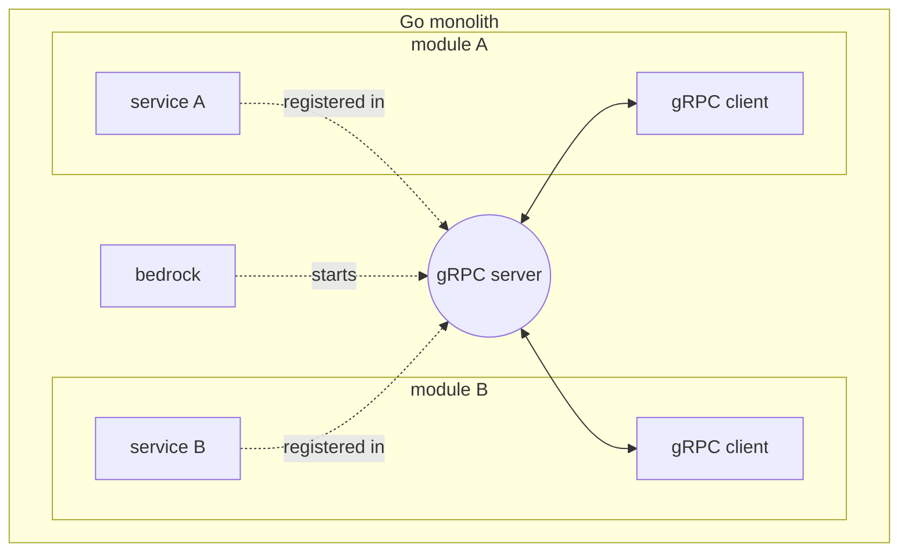
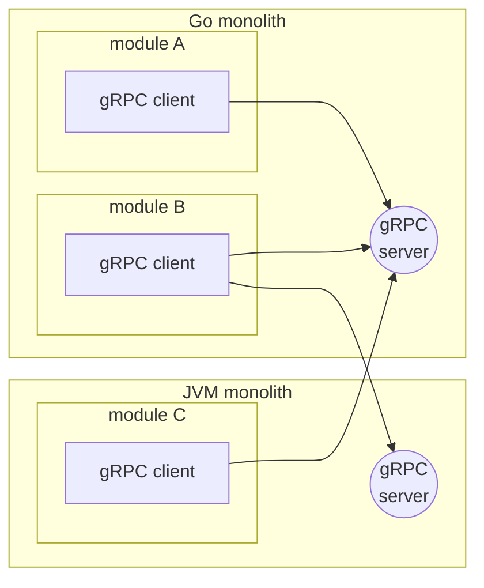
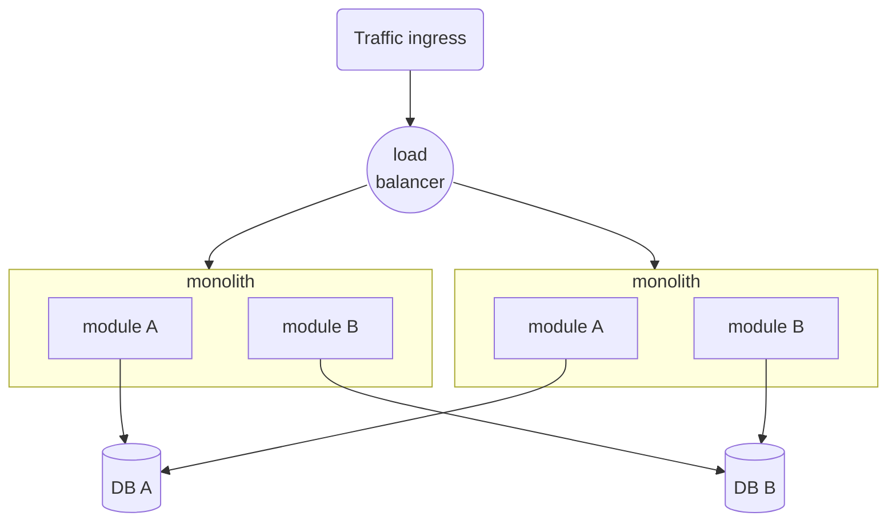

_03/10/2024 - #selfhosted #software-design #distributed-systems_
  

> 🔧 This post talks about my self-hosted cluster, [you can find an overview of it here](/projects/selfhosted-homelab).

I recently migrated my homelab’s Go microservices to a modular monolith. This blog is partly to talk about why, but
mostly about how.

# Why

I originally deployed a microservices
architecture [similar to Monzo’s](https://www.theregister.com/2020/03/09/monzo_microservices/) — that is:

- Many very tiny services with a single purpose each.
- A very consistent platform between services - they all share the same libraries for config, http, DB access, etc.
- Strict RPC APIs between services — they are not allowed to import each other’s library code.
- A service mesh (end-to-end mTLS between services via container sidecars)
- Two services never share access to the same database (or at least to the same database namespace)

I deployed, and it just worked well - there was nothing fundamentally wrong with it.
Something I like about this particular flavour of microservices is that, thanks to the monorepo pattern, there was very
little boilerplate.

But soon I realised that some shortcomings were too significant for my particular circumstances:

- Sidecars’ overhead. Because these are tiny services, the Consul sidecars actually take up as many or more resources
  than the services themselves.
  I am paying for my homelab’s compute myself, so this makes me more cost-sensitive.
- Latency. I don’t generally think that microservices’ added latency of the extra network hop is that bad: enterprise
  clusters are usually within the same availability zone, so the actual ping tends to be quite low.

  But I run a homelab that spans two living rooms in different countries and a german cloud provider, so the latency
  from a single Madrid-London hop is actually quite significant. A chained call of my ingress proxy, two
  microservices, and the DB (three hops) can easily go into the 200ms on network latency alone.

Note how added operational complexity was not really something I was suffering from: I already have a service mesh and
Nomad cluster going, so I do not individually orchestrate containers and their networking myself.

# How

Having set out to migrate from microservices to a monolith, I was worried about **how** I was going to design the
monolith’s modules while preserving the desirable separation between services that I had achieved.

Specifically, I wanted to preserve:

- Tiny modules with a single purpose each
- Strict RPC API boundaries between modules (which I found challenging because these are just Go libraries calling each
  other!)
- Two modules never share access to the same database (or at least to the same database namespace)
- Horizontal scaling
- If desirable in the future, polyglot modules (I do not want to commit to Go as only language I can ever use)

This let me to the following design decisions:

## gRPC for inter-module communication

While gRPC is an uncontroversial choice for microservices, it makes less sense for a monolith that does not need a
network for modules to communicate.

The main motivations for me were:

- It’s harder to define clear APIs when APIs are just normal Go code: there are more abstractions available, which can
  make the API more complicated.
- I want to be able to go back to microservices if I wish it. Using gRPC allows me to define APIs that can survive
  physically separating client and server in the future.
- gRPC speaks many languages. If I write a separate JVM modular monolith in the future, I want JVM modules to be able to
  call my Go monolith with the same API that other Go modules would.

The way I structure this is a single gRPC server in the monolith where each module is welcome to register its own gRPC
server. The monolith’s core (which I called `bedrock`) then starts the server and modules are welcome to connect with
their own gRPC clients.

The main trade-off here is that for module A to speak to module B we are suddenly using a whole gRPC server and going
through a network socket — whereas this could have been a simple Go function call.

I think that the latency incurred for this is still minimal compared to what we had in microservices-land, and that this
actually gives me a fair bit of flexibility, as I can migrate back to microservices with relative ease and call the same
gRPC APIs from other languages’ monoliths.

If we zoom out of a single modular monolith, we can picture cross-language monoliths communicating like so:

I quite like the idea that module A does not “care” if module B is a JVM or a Go module, because it talks to all of them
via gRPC anyway.

## Compile-time module segregation

For the above to work, where modules only know about each other via gRPC/protobuf APIs, modules cannot be calling each
other’s functions directly. Nothing is preventing this on a language level because they run in the same binary so this
requires some discipline and therefore added checks.

In order to assert this segregation, as part of CI I will also compile each module in isolation from all other modules,
and verify there are no compilation errors. The only exceptions are libraries shared among modules (for say, telemetry)
and the `.proto` files that define gRPC APIs.

I achieve this by making each module a Go package with its own Nix build that excludes sources from other modules. This
is straightforward using Nix's source filtering. It's also possible with Make, although it requires copying the
necessary
files to temporary directories before compilation.

## Horizontal Scaling

Achieving horizontal scaling for a monolith is conceptually simple but challenging to implement: the entire monolith
must be stateless. Then we can simply instance more monoliths and load-balance between them.

At the scale of my homelab at the time of writing, statelessness is easy for me to achieve. I currently use the module’s
database for synchronisation, and if necessary in the future I can use Consul for distributed locks.

Thanks to limiting a module to at most a single database namespace, modules can be confident they control all
writes to said database and do not need to worry about writes from other modules. They only need to manage competing
writes among instances of themselves.

> If the homelab every becomes a bigger platform, I will write again about how I overcame the challenge of state beyond
> database locks!

# How I chose not to do it

I do think it is worth discussing what alternatives I considered and why I did not pick them, if only for my own
benefit:

- **Messaging in addition to gRPC**

  While I do strongly believe in asynchronous messaging as a design pattern, I have not set up anything suitable to
  support it in my cluster. I decided I preferred doing without messaging rather than self-hosting Kafka or RabbitMQ.

  While messaging in-memory would have worked within a single monolith, it would not have scaled to multiple monolith
  instances.

- **A gRPC server per module, rather than per monolith**

  I seriously considered this for further segregation, but found it tricky to implement without having a sidecar per
  gRPC server (which would have just multiplied my infrastructure cost, again)

# References

- [Nix: Source filtering with file sets](https://www.tweag.io/blog/2023-11-28-file-sets/)
- [gRPC.io](https://grpc.io/)
- [What is a Service Mesh (AWS)](https://aws.amazon.com/what-is/service-mesh/)