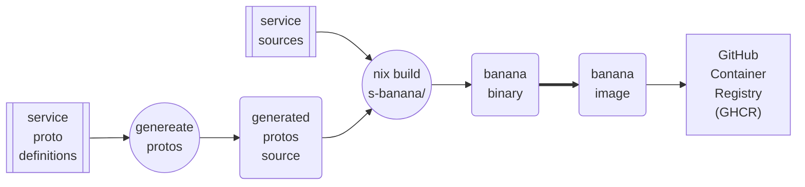
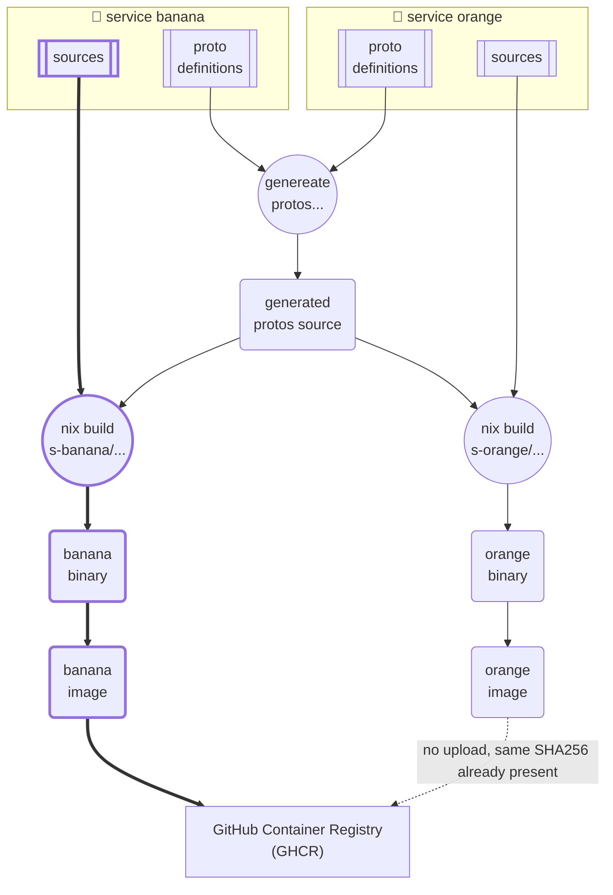

_25/08/2024 - #reproducible #nix #githubactions #gha #docker #caching #ghcr_

> 🔧 This post talks about my self-hosted cluster, [you can find an overview of it here](/projects/selfhosted-homelab).

I [have written before](https://monzo.com/blog/securing-our-software-supply-chain-better-with-reproducible-builds-for)
about the benefits of (bit-by-bit) reproducible builds, specifically in the context of security. But this post is about
a happy consequence of using those in my own homelab, which I later realised also applies to the bigger Nix binary
caches, and is unrelated to security.

For context, I run a homelab that looks a bit like a small company’s: I have a monorepo with Go microservices which get
built into Docker images in CI. I can then use those public images when writing Nomad jobs.

The process of going from Go source to a Docker image in GHCR is something I built relatively recently.
Because I already use NixOS for all my bare-metal configuration management, it made sense to stick to Nix to build the
Docker images (I am a fan of using fewer tools, but using them well).

For simplicity, I wished to stick to GitHub actions, and did not want to write complicated “rebuild this when this other
file changes” logic within CI.

So I decided to naively write a simple Nix build that took care of the protos codegen, then compilation, then assembling
the docker image.

Then, for every individual service, my Nix build graph looks roughly like the following:

In my eyes this had the unfortunate side effect where it would be **rebuilding everything, every time**.
I would also have image spam in GHCR, where **every main branch commit would push a new image for each service**.
But was willing to pay this price because I have a small number of services and little patience for a more complicated
setup.

But, to my slight surprise, when I started pumping out commits, I saw the following:

What we have here is several commits producing new tags in existing images, rather than each pushing an entirely new image.

So what happened? It turns out that if I have service A and B, and throughout a few commits I only change service B, the
reproducible build produces the exact same binary (and image) for service A. When the time comes to upload to GHCR,
the client (in my case [skopeo](https://github.com/containers/skopeo)) notices that the SHA256 digest matches an
existing image in the registry, so it just tags the existing image with the new tag, rather than re-uploading.

In a way, this is nothing surprising, it’s just standard deduplication. But this deduplication would not be possible
without reproducible builds, because then we would not have identical binaries, so there would be no identical images to
deduplicate in the first place!

> With a more typical `gradle/make build`  then `docker build stack`, this would not have happened at all, because the
> resulting binaries would have produced differing SHA256 for the images.

So ok, fine, good for me: I saved a few seconds on an image upload, and saved space by deduplicating images on a repo
that was free to begin with (thanks GitHub). Can we do better?

Turns out that if we add some caching to the mix, we can further speed up CI build time. I
used `DeterminateSystems/magic-nix-cache-action` , which will cache Nix builds. We now are able to
cache the intermediary steps of the compilation of the service where we did not change any sources (service orange in
the example below).

This means that we achieve _“recompile only the changed services”_ in the monorepo’s CI without having to write any
complex logic around detecting files’ changes 🎉

To sum it up, we told GitHub CI to just compile everything on every single push, but thanks to reproducible builds and
to Nix’s way of caching-via-inputs-hash, we achieved complex monorepo CI logic where we only built changed
microservices. And almost by accident! Bit-by-bit reproducible builds are tricky, but they have benefits beyond security.

> If you would like to see a working example of the above, you can [browse my repo](https://github.com/Cottand/selfhosted/tree/1652149db8480a5dbe6ae1669233791694d4995e) at the time of writing.
> The GitHub actions workflow is [here](https://github.com/Cottand/selfhosted/blob/1652149db8480a5dbe6ae1669233791694d4995e/.github/workflows/main.yml),
> while the Nix package definition is [here](https://github.com/Cottand/selfhosted/blob/1652149db8480a5dbe6ae1669233791694d4995e/services/s-rpc-portfolio-stats/package.nix).

## References

- [`pkgs.dockerTools`, nixpkgs documentation for building Docker image with Nix](https://ryantm.github.io/nixpkgs/builders/images/dockertools/)
- [`DeterminateSystems/magic-nix-cache-action`, to cache Nix in GitHub Actions](https://github.com/DeterminateSystems/magic-nix-cache-action)