_21/05/2023 - #oci #cloud #load-balancer #nat #igw #nlb #lb_
  

> 🔧 This post talks about my self-hosted cluster, [you can find an overview of it here](/projects/selfhosted-homelab).

This is a short one that I would like to share simply because I found
very little help online about how to do this. I hope
this post becomes that one resource that you find by googling, and it helps solve your weird unique
problem!

TL;DR: Oracle Cloud (OCI) load-balancers are a bit finicky.

It turns out that:

- Network load balancers (NLBs) cannot route traffic to an IP address on the internet (only to something inside OCI)
- Application-level load balancers (LBs) can, but they need to be in a Virtual Cloud Network (VCN) with a NAT Gateway
- To accept connections from the internet, load-balancers need to be in a network with an Internet Gateway

This means that, in practice, **you cannot have a public load-balancer
that forwards to hosts that are also in the internet**.
I tried to do exactly this, and it took me a fair amount of trial and error to understand that it was not working
because
of the reasons above.

This blog post is meant to show how I got around this limitation.

### Doing the thing

The idea is to use a public network load-balancer to proxy traffic to a private
load balancer, which then sends the packets out via a NAT.

```mermaid
graph LR
    style ingressRT fill: #0000, stroke-width: 1px, stroke-dasharray: 5 7
    style egressRT fill: #0000, stroke-width: 1px, stroke-dasharray: 5 7
    subgraph ingress["ingress subnet"]
        IGW(("Internet \n Gateway")) -->|TCP| NLB("Network \n load balancer \n (public)")
        ingressRT["` **Ingress routing table** 0.0.0.0/0 → IGW`"]
    end

    NLB -->|TCP| LB

    subgraph egress["egress subnet"]
        LB("Load \n balancer \n (private)") --> NGW(("NAT \n Gateway"))
        egressRT["` **Egress routing table** 0.0.0.0/0 → NGW`"]
    end

    NGW --> BE1 & BE2
    BE1["Backend 1"]
    BE2["Backend 2"]
```

You need to be mindful of some additional settings for this to work:

- You need to put the load balancers in different subnets
- In each subnet, you need to add an entry to the route table to forward traffic to either the IGW or NAT gateway
- Make sure _"Preserve source IP"_ is off in the web console (do not trust the Terraform setting!)
- If your backends expect HTTPS (and they should if you want your traffic to be encrypted!) then make sure
  both load-balancers are proxying TCP, rather than HTTP(S) in the egress LB.

### Bonus points

This is all at no extra cost, because NLBs are free in OCI. A single app-level load balancer
at 10Mbps is also free, so you can use this setup to provision a load balancer in the
internet for your homelab, rather than paying for Cloudflare's or Hetzner's.

Personally, I do the following:

