I run a personal fleet of a few old computers in my living room which run services like
- Personal DB
- Password manager
- Personal storage and backups
- VPN, with adblocking
- ... and hosts some of the projects you see in this website!

I made it thinking about how I would build a company's fleet as an SRE. It has a mostly open-source stack with:
- Container orchestration through [Nomad](https://www.nomadproject.io/) (an alternative to Kubernetes)
- Metrics, performance monitoring, and logs management through [Grafana](https://grafana.net), [Prometheus](https://prometheus.io/docs/introduction/overview/) and [Loki](https://grafana.com/oss/loki/)
- Secure private networking through [Wireguard](https://www.wireguard.com/)
- Reproducible, declarative deployments of the Linux OSs through [NixOS](https://nixos.org/) (although sometimes I install other OSs on some machines to experiment!)

## Networking

The networking is not too complicated once you get past the VPN
abstraction, which is the tricky bit to achieve without a SPOF.
Some of my nodes are IPv6-capable and are IPv4-public, some are not IPv4-public, and one is neither and is behind a [CGNAT](https://en.wikipedia.org/wiki/Carrier-grade_NAT)
and doesn't have a IPv6 address.

To get around this, I made a mesh network where all IPv6 capable node
establishes a VPN tunnel with each other.
The only exception is Bianco, which is behind a Spanish ISP's CGNAT
and it has no IPv6. To get around that, Bianco uses Cosmo as a hub-and-spoke. 

Ingress is structured as follows:

```mermaid
%% !caption: Ingress setup
graph LR
    Internet(("🌐 \nInternet"))
        
    subgraph dcNode["non-CGNAT node"]
%%            direction LR
            traefik("traefik container")
    end
        
    subgraph dcNode2["non-CGNAT node"]
        traefik2("traefik container")
    end

    subgraph anyNode["any node"]
        containerServer("container with \nservice's HTTP")
    end
        
        Internet -.->|HTTPS|traefik
        Internet -.->|HTTPS|traefik2
        traefik & traefik2 -->containerServer
        dcNode & dcNode2===|wireguard |anyNode
%%        dcNode===|wireguard|dcNode2
```

## Orchestration

Container orchestration is done with Nomad. All nodes are clients (meaning
a container can get scheduled on any node) and 3 nodes are Nomad servers
(ie, the host the Nomad 'control plane', in k8s lingo).

The nodes that host Nomad servers happen to be the datacenter-hosted nodes,
because they have more uptime than the ones hosted on London or Madrid.

```mermaid
%% !caption: Orchestration setup
graph TD
    subgraph DC2["DC-hosted node"]
        NomadS2[["Nomad Server"]]
        NomadCdc2[["Nomad client"]]
        c3("🐳 Container \n workload")
    end

    subgraph DC1["DC-hosted node"]
        NomadS[["Nomad Server"]]
        NomadCdc[["Nomad client"]]
        c2("🐳 Container \n workload")
    end

    subgraph home1["House-hosted node"]
        NomadCh[["Nomad client"]]
        c1("🐳 Container \n workload")
    end

    NomadS -->|manages| NomadCdc
    NomadS ~~~ NomadCdc2
    NomadS2 -->|manages| NomadCdc2
    NomadCdc2 -->|schedules| c3
%%        NomadS<-.->|Gossip|NomadS2
    NomadS -->|manages| NomadCh
    NomadCh -->|schedules| c1
    NomadCdc -->|schedules| c2
```

All containers in the cluster are managed by Nomad. All non-containerised
workloads (Nomad and Vault) are configuration-managed via NixOS.

## Monitoring

All of this has a Grafana monitoring stack (Loki, Mimir, Grafana, etc).
I do believe it a bit of an anti-pattern to run the monitoring on top of the infrastructure
you are trying to monitor, but I chose to be pragmatic.

## Looking back

Overall, the setup is overkill for what I am running (a few containers, really). I could achieve most of this with SSH and docker compose alone, but
I learnt a great deal of [SRE skills](https://en.wikipedia.org/wiki/Site_reliability_engineering) by trying to make a industry-grade platform that could scale to 10 or 1000 services!

If I was to found a startup tomorrow and had to develop its platform, I would reuse much of the technology I used for this side-project.
