I run a personal fleet of a several servers and few old computers in my living room which run services like

- Personal DB
- Personal storage and backups
- VPN, with adblocking
- ... and hosts some of the projects you see in this website!

It also hosts all the infrastructure required to support that deployment.
Learning to create resilient low-maintenance infrastructure
is a also a goal -- the means is an end in itself!

I made it thinking about how I would build a company's platform as an SRE.
It has a mostly open-source stack with:

- Container orchestration through [Nomad](https://www.nomadproject.io/) (an alternative to Kubernetes)
- Metrics, performance monitoring, and logs management
  through [Grafana](https://grafana.net), [Prometheus](https://prometheus.io/docs/introduction/overview/)
  and [Loki](https://grafana.com/oss/loki/)
- Secure private networking through [Wireguard](https://www.wireguard.com/)
- Reproducible, declarative deployments of the Linux OSs through [NixOS](https://nixos.org/) (although sometimes I
  install other OSs on some machines to experiment!)
- Service discovery and a service mesh thanks to [Consul](https://github.com/hashicorp/consul)
- Infra-as-code thanks to Terraform
- Service-to-service communication via [gRPC](https://github.com/grpc)

In this page I write up a technical overview of how I have architected the cluster.
For findings and milestones I have achieved over time, you can [check out
my blog](https://nico.dcotta.com/blog) (which is hosted here too!).

I aim to update this page as the fleet evolves (I started in April 2023) so that
it is up-to-date. Some notable milestones include, in order:
- from docker-compose to Nomad
- from plaintext orchestration to the mTLS Consul service mesh
- from hardcoded secrets to a HA Vault cluster
- from a single Postgres node to a HA CockroachDB cluster
- from plain Nomad HCL jobs to Nix-templated jobs
- from no-code containers to proper a Go microservices monorepo

## Microservices

Inspired by [Monzo's monorepo](https://monzo.com/blog/2022/09/29/migrating-our-monorepo-seamlessly-from-dep-to-go-modules/), my [selfhosted repo](https://github.com/cottand/seflhosted) includes a `services/`
directory where I develop Go [microservices](https://www.youtube.com/watch?v=y8OnoxKotPQ).

These are tiny (a few Go files each) and use gRPC to communicate between
each other as well as the CockroachDB cluster for a backing store.

They are all built on CI on every [push to master](https://github.com/Cottand/selfhosted/actions/runs/10545182143/job/29215042623).
You can find a blog post about how the automation around the builds works [here](/blog/MonorepoCiReproducibleBuilds).

## Networking

### Getting around NATs

The networking is not too complicated once you get past the VPN
abstraction, which is the tricky bit to achieve without a SPOF.
Some of my nodes are IPv6-capable and are IPv4-public, some are not IPv4-public, and one is neither and is behind
a [CGNAT](https://en.wikipedia.org/wiki/Carrier-grade_NAT)
and doesn't have a IPv6 address.

To get around this, I made a mesh network where all IPv6 capable node
establishes a VPN tunnel with each other.
The only exception is Bianco, which is behind a Spanish ISP's CGNAT
and it has no IPv6. To get around that, Bianco uses Cosmo as a hub-and-spoke.

Using Wireguard as a mesh VPN has the huge advantage of a flat network topology
once inside the VPN, even when some Nodes get disconnected.

### Service Mesh

In a completely unnecessary impulse, I also deployed Consul to
operate an Envoy [service mesh.](https://en.wikipedia.org/wiki/Service_mesh)

Note that mTLS between containers was not strictly required as
all traffic is encrypted via WireGuard anyway.

### Ingress

Ingress is structured as follows:

Where traefik is able to do mTLS with the Consul service mesh.

## Orchestration

Container orchestration is done with Nomad. All nodes are clients (meaning
a container can get scheduled on any node) and 3 nodes are Nomad servers
(ie, the host the Nomad 'control plane', in k8s lingo).

The nodes that host Nomad servers happen to be the datacenter-hosted nodes,
because they have more uptime than the ones hosted on London or Madrid.

```mermaid
%% !caption: Orchestration setup
graph TD
    subgraph DC2["DC-hosted node"]
        NomadS2[["Nomad Server"]]
        NomadCdc2[["Nomad client"]]
        c3("🐳 Container \n workload")
    end

    subgraph DC1["DC-hosted node"]
        NomadS[["Nomad Server"]]
        NomadCdc[["Nomad client"]]
        c2("🐳 Container \n workload")
    end

    subgraph home1["House-hosted node"]
        NomadCh[["Nomad client"]]
        c1("🐳 Container \n workload")
    end

    NomadS -->|manages| NomadCdc
    NomadS ~~~ NomadCdc2
    NomadS2 -->|manages| NomadCdc2
    NomadCdc2 -->|schedules| c3
%%        NomadS<-.->|Gossip|NomadS2
    NomadS -->|manages| NomadCh
    NomadCh -->|schedules| c1
    NomadCdc -->|schedules| c2
```

All containers in the cluster are managed by Nomad. All non-containerised
workloads (Nomad and Vault) are configuration-managed via NixOS.

## Monitoring

All of this has a Grafana monitoring stack (Loki, Mimir, Grafana, etc).
I do believe it a bit of an anti-pattern to run the monitoring on top of the infrastructure
you are trying to monitor, but I chose to be pragmatic.

## Looking back

Overall, the setup is overkill for what I am running (a few containers, really). I could achieve most of this with SSH
and docker compose alone, but
I learnt a great deal of [SRE skills](https://en.wikipedia.org/wiki/Site_reliability_engineering) by trying to make a
industry-grade platform that could scale to 10 or 1000 services!

If I was to found a startup tomorrow and had to develop its platform, I would reuse much of the technology I used for
this side-project.
